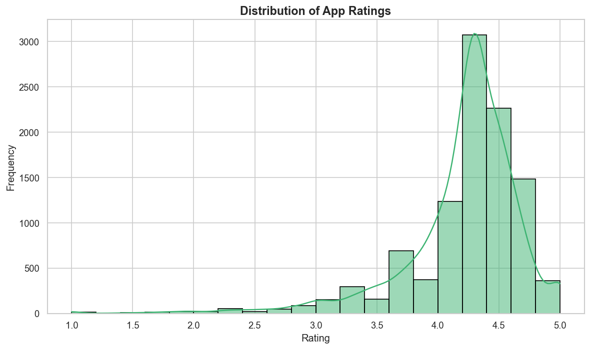
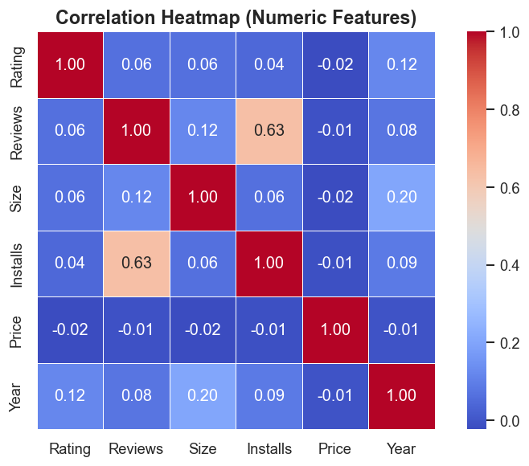
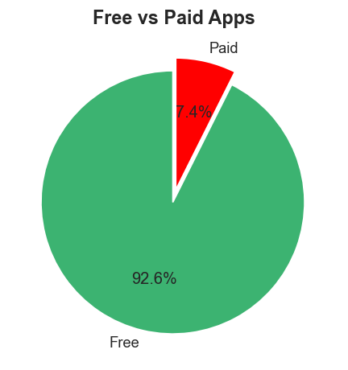
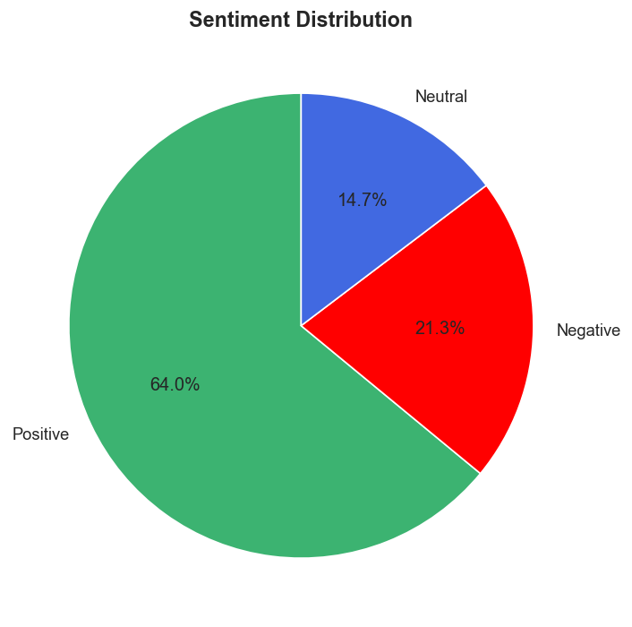
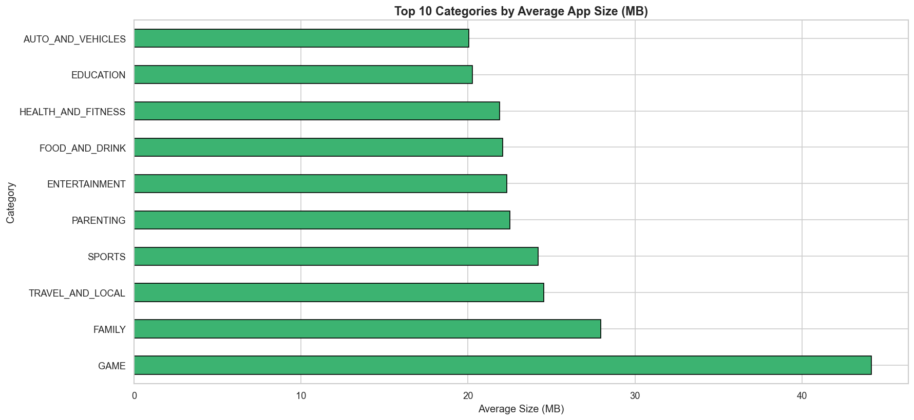
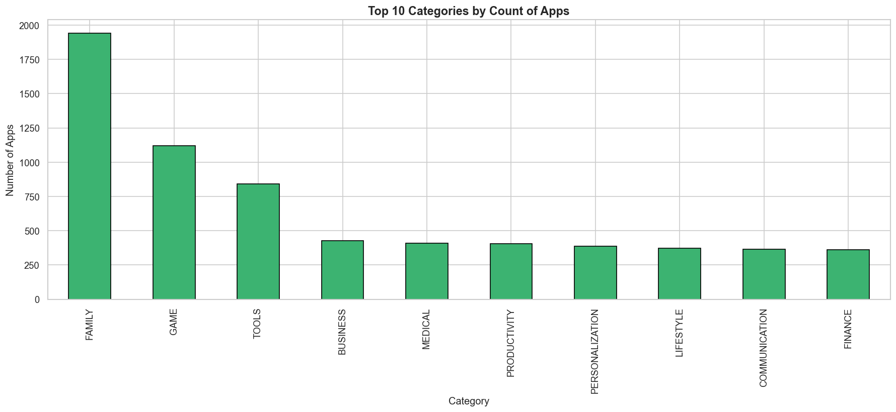
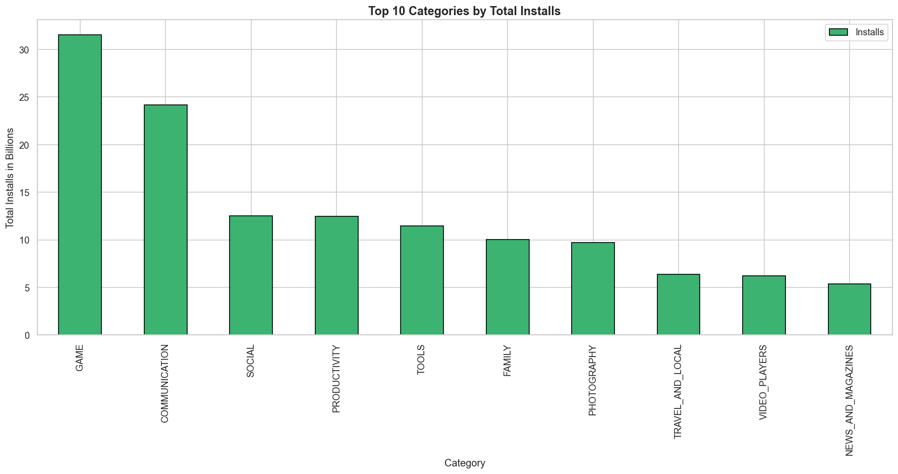
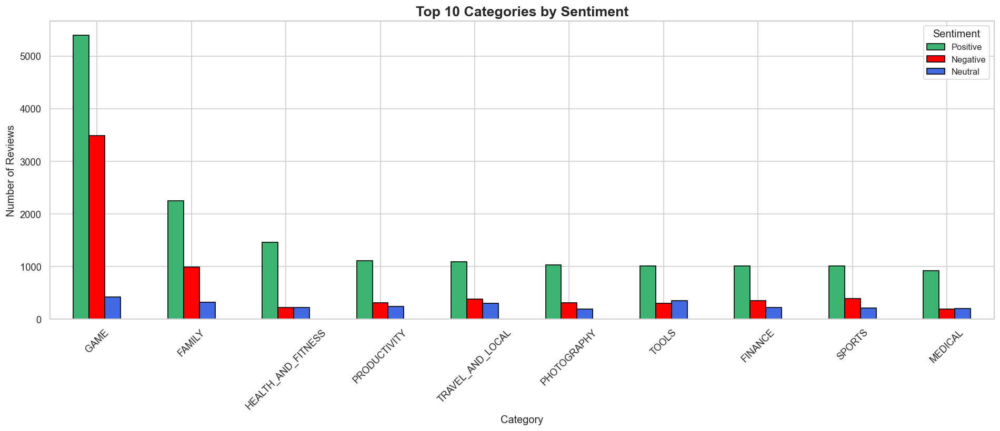

# Google Play Store App Success Analysis

An exploratory data analysis project on Google Play Store apps and user reviews. The notebook investigates which factors are most associated with app success, focusing on installs, ratings, app size, price, and user sentiment.

## Problem Statement

The Google Play Store contains thousands of apps across many categories. The goal of this project is to identify the factors that contribute to app success and understand how installs, ratings, pricing, app size, and user sentiment relate to each other.

## Dataset

- `Data/Play Store Data.csv`
- `Data/User Reviews.csv`

## Workflow

The analysis in `Main.ipynb` follows five phases:

```
# 📂 Google Play Store App Success Analysis
│
├── 📝 1. Project Identity & Setup
│   ├── ## Project Name
│   ├── ## Project Summary
│   └── ## GitHub Link
│
├── 🎯 2. Definition
│   ├── ## Problem Statement
│   └── ## General Guidelines
│
├── ⚙️ 3. Let's Begin ! 
│    │
│    ├── 📌 **Phase 1 :** Setup & Loading
│    │   └── (Import libraries & read dataset)
│    │
│    ├── 🔍 **Phase 2:** Data Exploration
│    │   └── (Know you data)
│    │   
│    │
│    ├── 🧼 **Phase 3 :** Data Cleaning & Transformation
│    │   └── (Handle missing values & duplicates)
│    │
│    ├── 📊 **Phase 4:** Deep-Dive Exploratory Data Analysis (EDA)
│    │   └── (Getting relation about the data)
│    │
│    ├── 📊 **Phase 5:** Visualization
│    │   ├── 📈 5.1  Why did you pick the specific chart?
│    │   ├── 🔀 5.2  What is/are the insight(s) found from the chart?
│    │   └── 🗺️ 5.3  Will the gained insights help creating a positive business impact?
│    └── 🧼 **Phase 6:** Insights
│        └── (Based on Visualization & Conclusion)
│
└── 💡 4. Final Summary 
    └── ## Key Insights & Actionable Recommendations
```

## Key Findings

- Installs and reviews are strongly related, which suggests that popular apps naturally attract more feedback.
- Free apps dominate the marketplace, making up about 92.6% of the dataset.
- Ratings are concentrated in the 4.0 to 4.5 range and do not strongly separate app success.
- App size and price have weak relationships with installs and reviews.
- User sentiment is mostly positive, with positive reviews making up about 64% of the review set.

## Visualizations

### Rating Distribution



### Correlation Heatmap



### Free vs Paid Apps



### Sentiment Distribution



### Top Categories by Average App Size



### Top Categories by Count of Apps



### Top Categories by Installs



### Top Categories by Sentiment



## Repository Contents

- `Main.ipynb` - full analysis notebook
- `Data/` - source CSV files
- `src/` - exported charts used in this report

## Conclusion

App success in the Google Play Store appears to depend more on category demand and user engagement than on technical properties such as app size, price, or rating alone. Free apps and high-demand categories such as Games and Communication lead in installs, while user sentiment remains largely positive across the dataset.
